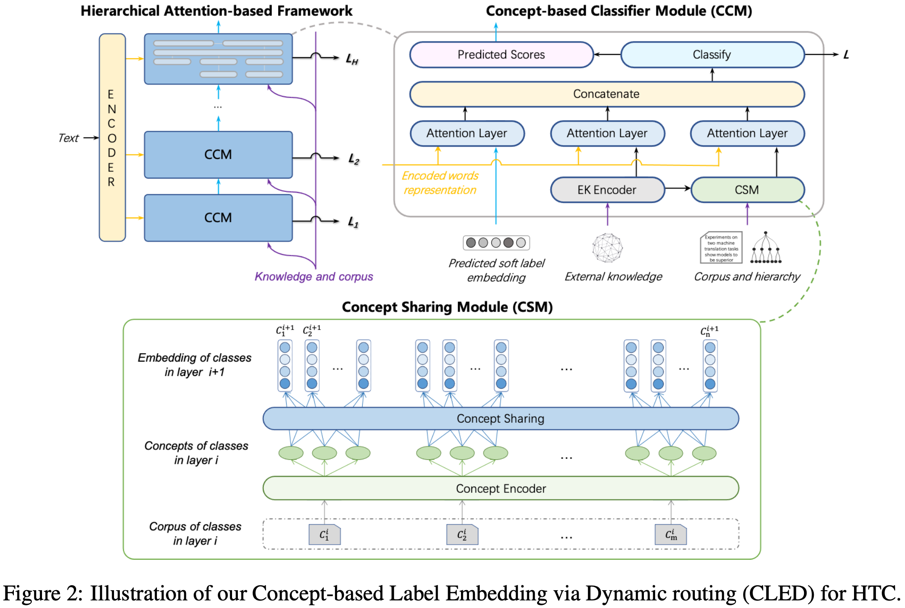

# CLEDforHTC

## Concept-Based Label Embedding via Dynamic Routing for Hierarchical Text Classification
[Concept-Based Label Embedding via Dynamic Routing for Hierarchical Text Classification](https://aclanthology.org/2021.acl-long.388) (Wang et al., ACL-IJCNLP 2021)

Hierarchical Text Classification (HTC) is a challenging task that categorizes a textual description within a taxonomic hierarchy. Most of the existing methods focus on modeling the text. Recently, researchers attempt to model the class representations with some resources (e.g., external dictionaries). However, the concept shared among classes which is a kind of domain-specific and fine-grained information has been ignored in previous work. In this paper, we propose a novel concept-based label embedding method that can explicitly represent the concept and model the sharing mechanism among classes for the hierarchical text classification. Experimental results on two widely used datasets prove that the proposed model outperforms several state-of-the-art methods. We release our complementary resources (concepts and definitions of classes) for these two datasets to benefit the research on HTC.

<p align="center"></p>


## Running
Running shell file: `code/start.sh`, train and test the model.

## Complementary to Dataset
We complement the public datasets WOS (Kowsari et al., 2017) and DBpedia (Sinha et al., 2018) by exacting the hierarchy concept and annotating the classes with the definitions from Wikipedia. We release these complementary resources and the code of the proposed model for further use by the community. The data path is data/complementary/DBpedia and WOS.

## How to Cite
```bibtex
@inproceedings{wang-etal-2021-concept,
    title = "Concept-Based Label Embedding via Dynamic Routing for Hierarchical Text Classification",
    author = "Wang, Xuepeng  and
      Zhao, Li  and
      Liu, Bing  and
      Chen, Tao  and
      Zhang, Feng  and
      Wang, Di",
    booktitle = "Proceedings of the 59th Annual Meeting of the Association for Computational Linguistics and the 11th International Joint Conference on Natural Language Processing (Volume 1: Long Papers)",
    month = aug,
    year = "2021",
    address = "Online",
    publisher = "Association for Computational Linguistics",
    url = "https://aclanthology.org/2021.acl-long.388",
    doi = "10.18653/v1/2021.acl-long.388",
    pages = "5010--5019",
    abstract = "Hierarchical Text Classification (HTC) is a challenging task that categorizes a textual description within a taxonomic hierarchy. Most of the existing methods focus on modeling the text. Recently, researchers attempt to model the class representations with some resources (e.g., external dictionaries). However, the concept shared among classes which is a kind of domain-specific and fine-grained information has been ignored in previous work. In this paper, we propose a novel concept-based label embedding method that can explicitly represent the concept and model the sharing mechanism among classes for the hierarchical text classification. Experimental results on two widely used datasets prove that the proposed model outperforms several state-of-the-art methods. We release our complementary resources (concepts and definitions of classes) for these two datasets to benefit the research on HTC.",
}
```


